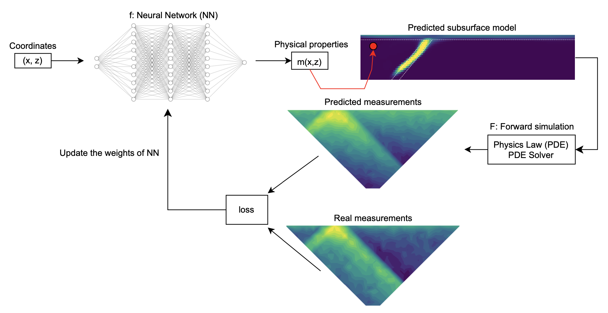

# Toward understanding the benefits of neural network parameterizations in geophysical inversions: a study with neural fields

_Anran Xu and Lindsey J. Heagy_

[https://doi.org/10.1109/TGRS.2025.3583970]([https://doi.org/XXX](https://doi.org/10.1109/TGRS.2025.3583970))



## Summary

Recent research in test-time machine-learning methods has shown that some machine-learning models, without any prior learning, can improve the results of geophysical inversions. Some examples include the deep image prior inversions (DIP-Inv) and the neural fields inversions (NFs-Inv), where the inverse problems are reparametrized by the weights of the machine-learning models. In this work, we employ neural fields (NFs), which use neural networks (NNs) to map a coordinate to the corresponding physical property value at that coordinate, in a test-time learning (TTL) manner. For a TTL method, the weights are learned during the inversion, as compared to traditional approaches, which require a network to be trained using a training dataset. Results for synthetic examples in seismic tomography and direct current resistivity (DCR) inversions are shown first. We then perform a singular value decomposition (SVD) analysis on the Jacobian of the weights of the NN (SVD analysis) for both cases to explore the effects of NNs on the recovered model. The results show that the TTL approach can eliminate unwanted artifacts in the recovered subsurface physical property model caused by the sensitivity of the survey and physics. Therefore, NFs-Inv improves the inversion results compared to the conventional inversion in some cases, such as the recovery of the dip angle or the prediction of the boundaries of the main target. In the SVD analysis, we observe similar patterns in the left-singular vectors as were observed in some diffusion models, trained in a supervised/self-supervised manner, for generative tasks in computer vision. This observation provides evidence that there is an implicit bias, which is inherent in the NN structures, that is useful in supervised/self-supervised learning and TTL models. This implicit bias has the potential to be useful for recovering models in geophysical inversions.

## Citation
```
@article{xu_heagy_2025,
  author={Xu, Anran and Heagy, Lindsey J.},
  journal={IEEE Transactions on Geoscience and Remote Sensing}, 
  title={Toward Understanding the Benefits of Neural Network Parameterizations in Geophysical Inversions: A Study With Neural Fields}, 
  year={2025},
  volume={63},
  number={},
  pages={1-14},
  keywords={Training;Inverse problems;Three-dimensional displays;Rendering (computer graphics);Image reconstruction;Geophysical measurements;Conductivity;Computational modeling;Biomedical measurement;Encoding;Deep learning (DL);deep neural networks (DNNs);direct current resistivity (DCR);geophysical inversions;implicit bias;inductive bias;neural fields (NFs);seismic tomography;test-time learning (TTL)},
  doi={10.1109/TGRS.2025.3583970}}

```
